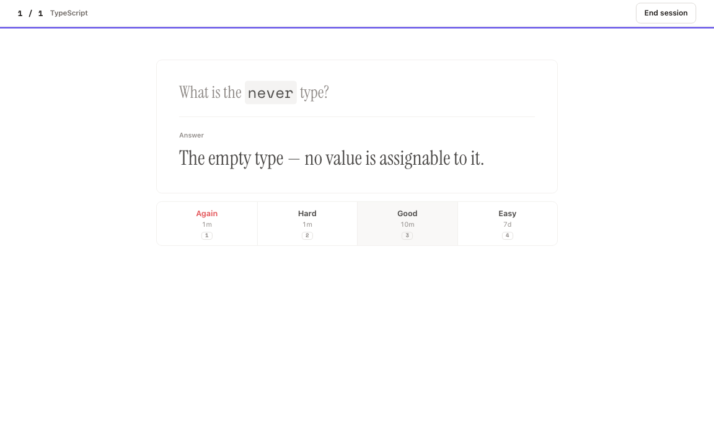

# rem

**Local-first spaced repetition with agent-friendly CLI capture, FSRS-6 scheduling, Markdown cards, and optional Git sync.**

[](https://github.com/shettyh/rem/actions/workflows/ci.yml)
[](https://github.com/shettyh/rem/releases/latest)
[](LICENSE)
[](https://tauri.app)

rem pairs a quiet, keyboard-friendly desktop interface with FSRS-6 scheduling, rich Markdown cards, useful study statistics, and optional Git-backed sync. Your collection stays on your device and remains exportable—no account or hosted service is required.

> [!IMPORTANT]
> rem is a native [Tauri](https://tauri.app) desktop app for macOS, Linux, and Windows. The browser build is only the source for Tauri's webview and is not a supported version of the app.

<picture>
  <source media="(prefers-color-scheme: dark)" srcset="docs/assets/rem-review-dark.png">
  
</picture>

## Features

- **Local-first by default** — decks, cards, assets, and review history live on your device.
- **Modern scheduling** — FSRS-6 runs in Rust, with configurable retention, learning steps, daily limits, and per-deck parameter optimization.
- **Rich Markdown cards** — a WYSIWYG editor with code highlighting, images and GIFs, links, lists, and tags.
- **Fast review flow** — keyboard shortcuts, four-grade reviews, interval previews, custom study, and leech handling.
- **Actionable statistics** — review activity, recall rate, streaks, grade distribution, and per-deck breakdowns.
- **Portable data** — import and export full-fidelity JSON backups.
- **CLI capture** — add Markdown cards individually or in atomic JSON batches from terminals and AI agents.
- **Optional Git sync** — sync through any Git remote using your existing system credentials; rem does not store an access token.
- **Calm desktop design** — quiet light and dark themes keep reviews focused and primary actions clear.

## Installation

Download the latest installer for your platform from [GitHub Releases](https://github.com/shettyh/rem/releases/latest).

| Platform | Desktop packages | CLI archives |
| --- | --- | --- |
| macOS | Apple Silicon and Intel DMG | Apple Silicon and Intel `.tar.gz` |
| Linux | AppImage, `.deb`, and `.rpm` | x86_64 `.tar.gz` |
| Windows | `.msi` and `.exe` | x86_64 `.zip` |

### macOS and Linux installer

```sh
curl -fsSL https://raw.githubusercontent.com/shettyh/rem/main/install.sh | sh
```

This installs both the desktop app and the `rem` CLI. On Linux, launch the desktop AppImage with `rem-app`; `rem` is reserved for the CLI. The AppImage requires FUSE. Debian and Ubuntu users can install it with `sudo apt install libfuse2`.

Windows releases include a separate CLI zip. Extract `rem.exe` into a directory on `PATH`.

### Unsigned build notice

Current macOS and Windows builds are not notarized or code-signed with paid platform certificates. On macOS, right-click **rem** and choose **Open**, or clear quarantine after moving the app to `/Applications`:

```sh
xattr -dr com.apple.quarantine /Applications/rem.app
```

## Getting started

1. Create a deck from the **Today** screen.
2. Add cards with a front, back, and optional tags or images.
3. Start a review and reveal each answer with <kbd>Space</kbd>.
4. Grade your recall with the on-screen controls or keyboard shortcuts.
5. Optionally configure backups and Git sync from **Settings**.

Cards can also be captured while the app is closed:

```sh
rem deck list
rem card add --deck <deck-id> --front 'Question' --back 'Answer' --tag topic
```

See the [CLI reference](docs/cli.md) for JSON batch input, dry runs, and result schemas. AI agents can use the bundled [`rem-card-capture` skill](.agents/skills/rem-card-capture/SKILL.md) to create source-grounded cards through the same public CLI.

## Data and sync

rem stores local data in SQLite through its native Rust layer. JSON backup files preserve decks, cards, scheduling state, and review history.

Git sync is optional. When enabled, rem shells out to your system `git`, uses its existing credentials, and synchronizes a human-inspectable file-per-deck repository. Records are merged with last-writer-wins semantics, while tombstones propagate deletions between machines. CLI capture is local and joins Git only on the desktop app's next sync.

## Development

### Prerequisites

- [Node.js 22](https://nodejs.org)
- [Rust stable](https://www.rust-lang.org/tools/install)
- The [Tauri v2 platform prerequisites](https://v2.tauri.app/start/prerequisites/)
- Git, if you want to test sync

### Run locally

```sh
git clone https://github.com/shettyh/rem.git
cd rem
npm ci
npm run app:dev
```

Use `npm run app:dev`, not `npm run dev`. The latter starts only the internal Vite server consumed by the native webview.

### Useful commands

| Command | Purpose |
| --- | --- |
| `npm run app:dev` | Run the native app in development mode |
| `npm run app:build` | Build native installers for the current platform |
| `npm test` | Run unit and real-browser UI tests |
| `npm run typecheck` | Type-check the frontend |
| `npm run build` | Type-check and build the frontend webview |
| `cd src-tauri && cargo test` | Run Rust tests |
| `cd src-tauri && cargo run -p rem-cli -- --help` | Run the CLI from source |

Browser tests require Playwright's Chromium binary:

```sh
npx playwright install chromium
```

## Releasing

Releases are gated by a Release Please pull request:

1. Give feature and fix pull requests [Conventional Commit](https://www.conventionalcommits.org/) titles and squash-merge them into `main` so each change produces one clean changelog entry.
2. Release Please opens or updates a `chore: release vX.Y.Z` pull request with the generated changelog and synchronized Node, Rust, and Tauri versions.
3. Review that pull request and wait for CI to pass. Merge it when the accumulated changes are ready to ship.
4. The release workflow creates a draft GitHub Release and builds the macOS, Linux, and Windows installers and CLI archives.
5. The workflow publishes the release only after every app and CLI build succeeds. A failed build leaves the release as a draft so it cannot become `latest` accidentally.

Do not edit versions or create release tags manually. `feat` commits produce minor releases, `fix` commits produce patch releases, and breaking changes produce major releases. The repository must allow GitHub Actions to create pull requests under **Settings → Actions → General → Workflow permissions**.

## Architecture

rem keeps domain logic and infrastructure behind small interfaces so that product features do not depend directly on a database or scheduling implementation.

```text
src/
  app/         application entry point, routes, and auto-sync
  domain/      card/deck models and the Scheduler interface
  data/        Storage interface, native adapter, test persistence, backup, and Git sync
  features/    decks, cards, review, settings, and statistics
  ui/          app shell, shared components, themes, and design tokens
src-tauri/     native shell, shared SQLite core, terminal CLI, Rust FSRS-6, and Git bridge
```

The frontend uses React, TypeScript, and Vite. Tauri v2 provides the native shell, while `fsrs-rs` handles scheduling in Rust.

## Contributing

Issues and pull requests are welcome. For substantial changes, please open an issue first so the approach can be discussed before implementation.

Before submitting a pull request, run the same core checks used by CI:

```sh
npm test
npm run build
(
  cd src-tauri
  cargo fmt --all --check
  cargo clippy --workspace --all-targets -- -D warnings
  cargo test --workspace
)
```

## License

Licensed under the [Apache License 2.0](LICENSE).
